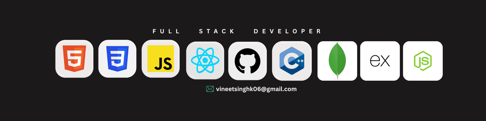

 

<h1 align="center">👋 Hi, I'm Vineet Chandel</h1>

---

<h1> 🚀 Summary </h1>

Actively upskilling as a full-stack web developer by building real-world, end-to-end applications. Passionate about creating scalable solutions and continuously learning new technologies.

## 🛠️ Technical Skills

| **Category** | **Technologies** |
|--------------|------------------|
| **Frontend** | React.js, Tailwind CSS, Redux, JavaScript |
| **Backend**  | Node.js, Express.js, JavaScript |
| **Database** | MongoDB, Mongoose |

---

## 📫 Connect with Me

---

⭐️ ***From [Vineet Chandel](https://github.com/Vineet-Chandel)***
